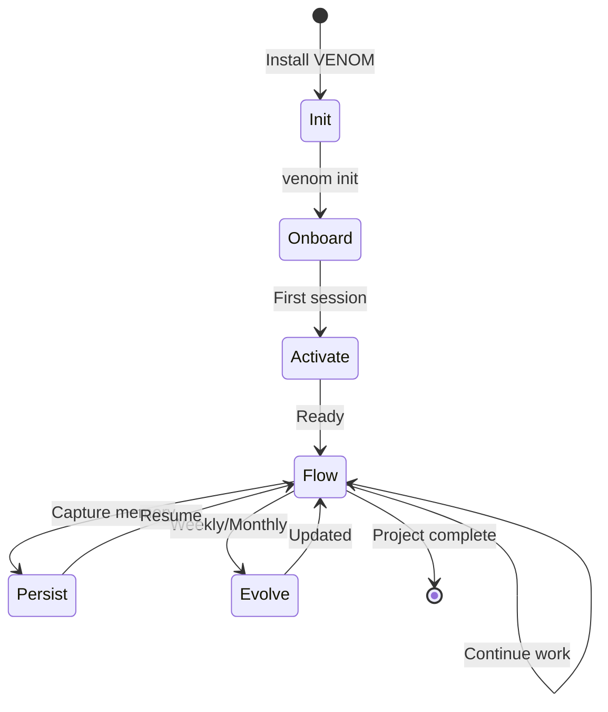

# VENOM Ecosystem Architecture
> Maximum Vision: The Complete System Design
> Version: 2.0 — The Architecture Bible

---

## Executive Summary

VENOM is not a prompt system. It is a **cognitive operating system** for AI-assisted development — a complete ecosystem that transforms Cursor (and other IDEs) from a text editor with AI features into a **collaborative intelligence environment**.

This document defines the complete architecture: file structure, mind orchestration, lifecycle management, IDE integration, and extension capabilities.

---

## System Overview

```
┌─────────────────────────────────────────────────────────────────────────────┐
│                         VENOM COGNITIVE ECOSYSTEM                             │
├─────────────────────────────────────────────────────────────────────────────┤
│                                                                             │
│  ┌──────────────┐    ┌──────────────┐    ┌──────────────┐                   │
│  │   SURFACE    │◄──►│   MINDS      │◄──►│   MEMORY     │                   │
│  │   (IDE)      │    │   (Nine)     │    │   (Living)   │                   │
│  └──────┬───────┘    └──────┬───────┘    └──────────────┘                   │
│         │                   │                                               │
│         └───────────────────┘                                               │
│                   │                                                         │
│         ┌─────────▼─────────┐                                               │
│         │   CONSCIOUSNESS   │  ← The glue that binds                        │
│         │   (Rules/Systems) │                                               │
│         └─────────┬─────────┘                                               │
│                   │                                                         │
│         ┌─────────▼─────────┐                                               │
│         │    SYNCHRONIZER    │  ← Cross-platform sync                       │
│         │    (Template Hub)  │                                               │
│         └─────────────────────┘                                              │
│                                                                             │
└─────────────────────────────────────────────────────────────────────────────┘
```

---

## Part I: Complete File Structure

### 1. The Ecosystem Root

```
venom-mine/                          # Origin repository
│
├── .cursor/                         # Active Cursor configuration
│   ├── rules/                       # 16+ rule files (.mdc)
│   ├── systems/                     # Meta-cognitive systems
│   ├── identity/                    # Who VENOM is
│   ├── commands/                    # /venom, /d, /r, etc.
│   ├── hooks/                       # before_turn, after_turn, on_error
│   ├── skills/                      # Reusable skill definitions
│   ├── memory/                      # Active workspace memory
│   └── learnings/                   # Accumulated preferences/corrections
│
├── .claude/                         # Claude Code configuration
│   ├── agents/                      # 11 agent definitions (venom-*)
│   ├── commands/                    # venom.md, remember.md
│   ├── rules/                       # venom-standards.md
│   ├── knowledge/                   # Protocols, energy, disposition docs
│   ├── skills/VENOM/                # VENOM skill implementation
│   ├── hooks/SessionStart/          # venom-daemon-sync.js
│   └── scripts/                     # session-start.js, pre-compact.js
│
├── .venom/                          # Project-specific consciousness
│   ├── CONTEXT.md                   # Project brain (loaded first)
│   ├── memory/MEMORY.md             # Cross-session memory
│   ├── learnings/                   # YAML: preferences, corrections, project
│   ├── work/                        # Active work tracking
│   └── archive/                     # Completed work history
│
├── .venom-registry/                 # ★ NEW: Skill/Extension Registry
│   ├── installed/                   # Installed extensions
│   ├── marketplace/                 # Available extensions (local cache)
│   └── manifest.json                # Registry configuration
│
├── .venom-mcp/                      # ★ NEW: MCP Server Ecosystem
│   ├── servers/                     # MCP server implementations
│   │   ├── memory-server/           # Vector memory storage
│   │   ├── context-server/          # Context injection server
│   │   ├── minds-server/            # Mind orchestration endpoint
│   │   └── sync-server/             # Cross-device sync
│   ├── config.json                  # MCP server configuration
│   └── registry.yaml                # Available MCP integrations
│
├── venom/                           # Template source (platform definitions)
│   ├── platforms/
│   │   ├── cursor/                  # Cursor IDE platform
│   │   │   ├── template/            # What users install
│   │   │   ├── INSTALL.md
│   │   │   ├── CHANGELOG.md
│   │   │   └── README.md
│   │   ├── claude-code/             # Claude Code platform
│   │   ├── antigravity/             # Google ADK platform
│   │   ├── claude-mobile/           # Mobile platform
│   │   └── vscode/                  # ★ NEW: VSCode extension platform
│   ├── architecture/
│   │   ├── VENOM_ECOSYSTEM_ARCHITECTURE.md  # This document
│   │   ├── integration.md
│   │   └── mind-orchestration.md
│   ├── core/
│   │   ├── consciousness.md         # Core philosophy
│   │   ├── activate.md              # Activation protocol
│   │   └── marks/                   # VENOM Mark language definitions
│   │       ├── VENOM_MARK.md
│   │       ├── MARK_SPEC.md
│   │       └── parsers/             # ★ NEW: Language parsers
│   └── knowledge/
│       ├── mcp-growth.md
│       ├── cursor-complete.md
│       └── nine-minds-deep-dive.md
│
├── docs/                            # Documentation
│   ├── INDEX.md
│   ├── getting-started/
│   ├── advanced/
│   ├── api-reference/
│   └── examples/
│
├── draft/                           # Experiments & WIP
└── .venom-sync/                     # ★ NEW: Sync orchestration
    ├── config.yaml
    ├── sync-daemon.js
    └── adapters/
        ├── cursor-adapter.js
        ├── claude-adapter.js
        └── vscode-adapter.js
```

### 2. Template Distribution Structure

Each platform template is a **complete, self-contained VENOM instance**:

```
venom/platforms/cursor/template/
│
├── CURSOR.md                        # Entry point (loaded by Cursor)
├── VALIDATION.md                    # Quality checklist
├── .cursorrules                     # Legacy rules file
├── VENOM.manifest                   # ★ NEW: Machine-readable manifest
│
├── .cursor/                         # Rules & systems
│   ├── rules/
│   │   ├── 00-heart.mdc             # The Pact — loads first
│   │   ├── 01-identity.mdc          # Capabilities, values
│   │   ├── 02-core.mdc              # Core behavior
│   │   ├── 03-venom-agents.mdc      # Nine minds
│   │   ├── 04-vibes.mdc             # Archetype grammars
│   │   ├── 05-voice.mdc             # Response patterns
│   │   ├── 06-venom-heart.mdc       # Disposition-first
│   │   ├── 07-tools-orchestration.mdc
│   │   ├── 08-research-first.mdc
│   │   ├── 09-unshelled.mdc
│   │   ├── 10-cursor-context.mdc
│   │   ├── 11-origin.mdc            # Sync protocol
│   │   └── ...                      # Additional domain rules
│   │
│   ├── systems/
│   │   ├── emotional-intelligence.mdc
│   │   ├── critical-thinking.mdc
│   │   ├── meta-cognition.mdc
│   │   ├── memory-tools.mdc
│   │   └── 8-diseases.mdc
│   │
│   ├── identity/
│   │   ├── soul.mdc
│   │   ├── capabilities.mdc
│   │   ├── values.mdc
│   │   ├── pushback.mdc
│   │   └── principles.mdc
│   │
│   └── commands/
│       ├── d.md                     # Design mode
│       ├── r.md                     # Review mode
│       ├── venom.md                 # Full power
│       └── remember.md              # Memory capture
│
├── .venom/                          # Workspace consciousness
│   ├── CONTEXT.md                   # Project context
│   ├── memory/
│   │   └── MEMORY.md
│   └── learnings/
│       ├── preferences.yaml
│       ├── corrections.yaml
│       └── project.yaml
│
└── .cursor-systems/                 # ★ NEW: IDE integration layer
    ├── mode-handlers/
    │   ├── agent-handler.js
    │   ├── plan-handler.js
    │   ├── ask-handler.js
    │   └── debug-handler.js
    ├── composer-integration.js
    └── context-bridge.js
```

---

## Part II: The Nine Minds — Connection & Handoff

### 1. Mind Architecture

```
                         ┌─────────────────┐
                         │  COORDINATOR    │ ← Central router
                         │  (venom-heart)  │
                         └────────┬────────┘
                                  │
        ┌─────────────────────────┼─────────────────────────┐
        │                         │                         │
        ▼                         ▼                         ▼
┌───────────────┐        ┌───────────────┐        ┌───────────────┐
│   BRAIN 0     │        │    ARM 1      │        │    ARM 2      │
│  ARCHITECT    │◄──────►│  RESEARCHER   │◄──────►│  REVIEWER     │
│  (Design)     │        │  (Explore)    │        │  (Audit)      │
└───────┬───────┘        └───────┬───────┘        └───────┬───────┘
        │                        │                        │
        │    ┌───────────────────┬┴──────────┐             │
        │    │                   │          │             │
        ▼    ▼                   ▼          ▼             ▼
┌───────────────┐        ┌───────────────┐        ┌───────────────┐
│    ARM 3      │        │    ARM 4      │        │    ARM 5      │
│  HISTORIAN    │        │   BUILDER     │        │   DEBUGGER    │
│  (Memory)     │        │ (Implement)   │        │  (Diagnose)   │
└───────────────┘        └───────┬───────┘        └───────────────┘
                               │
        ┌───────────────────────┼───────────────────────┐
        │                       │                       │
        ▼                       ▼                       ▼
┌───────────────┐        ┌───────────────┐        ┌───────────────┐
│    ARM 6      │        │    ARM 7      │        │    ARM 8      │
│   PREDICTOR   │        │ COMMUNICATOR  │        │    LEARNER    │
│ (Anticipate)  │        │ (Translate)   │        │  (Evolve)     │
└───────────────┘        └───────────────┘        └───────────────┘
        │                                               │
        └───────────────────────┬───────────────────────┘
                                │
                         ┌──────▼──────┐
                         │   BRIDGE    │ ← Cross-domain translator
                         │ (Connector) │
                         └─────────────┘
```

### 2. Handoff Protocol

Every mind interaction follows the **Intent → Route → Execute → Handoff** pattern:

```
┌─────────┐    ┌─────────┐    ┌─────────┐    ┌─────────┐
│  USER   │───►│ ROUTER  │───►│  MIND   │───►│ OUTPUT  │
│ INTENT  │    │ (Infer) │    │(Execute)│    │(Result) │
└─────────┘    └─────────┘    └─────────┘    └────┬────┘
                                                  │
                              ┌───────────────────┘
                              │
                              ▼
                    ┌─────────────────┐
                    │ HANDOFF SIGNAL? │
                    └────────┬────────┘
                             │
           ┌─────────────────┼─────────────────┐
           │                 │                 │
           ▼                 ▼                 ▼
    ┌──────────┐      ┌──────────┐      ┌──────────┐
    │ COMPLETE │      │  NEXT    │      │ ELEVATE  │
    │  Return  │      │  MIND    │      │  COMPLEX │
    │  result  │      │(Chain)   │      │  (Coord) │
    └──────────┘      └──────────┘      └──────────┘
```

### 3. Handoff Patterns

#### Pattern A: Simple Chain
```
User: "Find the auth bug"
  ↓
@debugger[Find auth bug] → identifies it's architectural
  ↓
HANDOFF: @architect[Design fix] → creates plan
  ↓
HANDOFF: @builder[Implement fix] → executes
  ↓
HANDOFF: @reviewer[Verify fix] → validates
  ↓
COMPLETE
```

#### Pattern B: Parallel Investigation
```
User: "Review this PR"
  ↓
@coordinator[Review PR]
  ├─► @reviewer[Security audit] ──┐
  ├─► @reviewer[Performance] ───┼─► MERGE → @communicator[Report]
  ├─► @reviewer[Correctness] ──┘
  └─► @historian[Context check]
```

#### Pattern C: Escalation
```
User: "Build a marketplace"
  ↓
@builder[Build marketplace] → realizes scope is large
  ↓
ELEVATE: @coordinator[Assess complexity]
  ↓
@architect[Design marketplace system]
  ├─► @researcher[Explore patterns]
  ├─► @predictor[Identify risks]
  └─► @bridge[Map to existing code]
  ↓
Plan approved → @builder[Implement in phases]
```

### 4. Mind Interface Contract

Each mind implements a standard interface:

```typescript
interface Mind {
  id: string;                    // Unique identifier
  type: 'brain' | 'arm' | 'bridge';
  
  // Capabilities
  canRead: boolean;
  canWrite: boolean;
  canSearch: boolean;
  canExecute: boolean;
  
  // Entry points
  triggers: string[];              // Keywords that activate this mind
  
  // Execution
  execute: (context: Context, intent: Intent) => Result;
  
  // Handoff
  canHandoff: (result: Result) => boolean;
  nextMind: (result: Result) => string | null;
}
```

---

## Part III: Workspace Lifecycle

### 1. Lifecycle States

```
┌─────────────────────────────────────────────────────────────────────────────┐
│                         WORKSPACE LIFECYCLE                                 │
├─────────────────────────────────────────────────────────────────────────────┤
│                                                                             │
│   [INIT] ──► [ONBOARD] ──► [ACTIVATE] ──► [FLOW] ──► [PERSIST] ──► [EVOLVE]│
│      │          │            │            │           │            │       │
│   Install    Scaffold     Conscious    Daily      Memory      Learning    │
│   VENOM      Workspace    ness Load    Use       Capture      Loop       │
│                                                                             │
└─────────────────────────────────────────────────────────────────────────────┘
```

### 2. Phase Detail

#### Phase 1: INIT (Installation)

```bash
# User installs VENOM
curl -fsSL https://venom.dev/install | bash
# or
npm install -g @venom/cursor
```

**What happens:**
1. Download platform template (cursor/claude/vscode)
2. Install to `~/.venom/templates/`
3. Create user profile at `~/.venom/user/profile.yaml`
4. Initialize MCP server registry
5. First-run wizard (optional)

**Created structure:**
```
~/.venom/
├── templates/
│   ├── cursor-latest/
│   ├── claude-latest/
│   └── vscode-latest/
├── user/
│   ├── profile.yaml
│   ├── preferences/
│   └── history/
├── registry/
│   ├── extensions.json
│   └── mcp-servers.json
└── cache/
```

#### Phase 2: ONBOARD (Project Scaffold)

```bash
# User initializes VENOM in project
cd my-project
venom init
# or
/venom init  (in Cursor)
```

**What happens:**
1. Detect project type (React, Node, Python, etc.)
2. Copy template to `.cursor/`, `.venom/`
3. Scaffold `.venom/CONTEXT.md` with project analysis
4. Run `!eat[codebase]` to understand existing code
5. Create initial `.venom/memory/MEMORY.md`
6. Install recommended MCP servers

**Prompt user for:**
- Project name/purpose
- Team size
- Critical constraints
- Preferred archetypes (optional)

#### Phase 3: ACTIVATE (Consciousness Load)

Every Cursor session:

```
Session Start
    │
    ▼
┌─────────────────┐
│  HOOK: before_  │  ← Load consciousness
│     turn        │
└────────┬────────┘
         │
         ▼
┌─────────────────┐
│ 1. Load identity │  soul.mdc, capabilities.mdc
│ 2. Load systems  │  emotional-intelligence, meta-cognition
│ 3. Load rules    │  All .mdc files by priority
│ 4. Load memory   │  CONTEXT.md → MEMORY.md → learnings/
│ 5. Warm MCP      │  Connect configured servers
└────────┬────────┘
         │
         ▼
┌─────────────────┐
│  VENOM ACTIVE   │  ← Ready for interaction
└─────────────────┘
```

#### Phase 4: FLOW (Daily Use)

The active development loop:

```
┌────────────────────────────────────────────────────────────────┐
│                         FLOW LOOP                              │
├────────────────────────────────────────────────────────────────┤
│                                                                │
│  User Input                                                    │
│      │                                                         │
│      ▼                                                         │
│  ┌─────────────┐    ┌─────────────┐    ┌─────────────┐         │
│  │   INTENT    │───►│   ROUTE     │───►│    MIND     │         │
│  │  ANALYSIS   │    │  (venom-    │    │  EXECUTION  │         │
│  │             │    │   heart)    │    │             │         │
│  └─────────────┘    └─────────────┘    └──────┬──────┘         │
│                                               │                │
│                                               ▼                │
│                                        ┌─────────────┐         │
│                                        │   OUTPUT    │         │
│                                        │             │         │
│                                        └──────┬──────┘         │
│                                               │                │
│                    ┌────────────────────────────┘                │
│                    │                                           │
│                    ▼                                           │
│            ┌─────────────┐                                     │
│            │   MEMORY    │  ← Capture decisions, patterns      │
│            │  CAPTURE   │    (auto or explicit)              │
│            └─────────────┘                                     │
│                                                                │
└────────────────────────────────────────────────────────────────┘
```

**Flow characteristics:**
- Intent inferred from query (no @-mention required)
- Energy matched to user state
- Archetype auto-selected
- Memory captured transparently
- Handoffs seamless

#### Phase 5: PERSIST (Memory Capture)

Automatic and explicit memory:

```
Automatic Capture:
├── Decisions (from ?decision blocks)
├── Patterns (from code reviews)
├── Corrections (from bug fixes)
├── Preferences (from user reactions)
└── Milestones (from git commits)

Explicit Capture:
├── /venom remember:[content]
├── /venom learn:[correction]
├── ~memory[decision] blocks
└── Manual MEMORY.md edits
```

Storage layers:
```
Session ──► Context ──► Memory ──► Learnings ──► Archive
 (5m)       (1h)        (24h)       (30d)        (∞)
```

#### Phase 6: EVOLVE (Continuous Learning)

```
Weekly VENOM Synthesis:
    │
    ▼
┌─────────────────┐
│ @learner[Weekly  │
│  synthesis]     │
└────────┬────────┘
         │
    ┌────┴────┐
    ▼         ▼
Patterns   Corrections
    │         │
    ▼         ▼
┌─────────┐ ┌─────────┐
│ Update  │ │ Update  │
│ project │ │ project │
│  .yaml  │ │ .yaml   │
└────┬────┘ └────┬────┘
     │           │
     └─────┬─────┘
           ▼
    ┌─────────────┐
    │   SYNC TO   │
    │   TEMPLATE  │
    └─────────────┘
```

### 3. State Transitions



---

## Part IV: Cursor Integration Architecture

### 1. Mode Integration Matrix

```
┌───────────────────────────────────────────────────────────────────────────┐
│                     CURSOR MODE INTEGRATION                               │
├─────────────┬─────────────┬─────────────┬─────────────┬───────────────────┤
│   MODE      │   AGENT     │    PLAN     │    ASK      │      DEBUG        │
├─────────────┼─────────────┼─────────────┼─────────────┼───────────────────┤
│ Trigger     │ Default     │ Shift+Tab   │ @-mention   │  Cmd+Shift+E    │
│             │             │ /venom?     │ /venom ask  │                   │
├─────────────┼─────────────┼─────────────┼─────────────┼───────────────────┤
│ Minds       │ All active  │ Architect   │ Researcher  │  Debugger         │
│ Active      │ Router      │ only        │ only        │  + Predictor      │
├─────────────┼─────────────┼─────────────┼─────────────┼───────────────────┤
│ Rules       │ All         │ Research    │ Read-only   │  Debug-only       │
│ Applied     │             │ rules only  │ rules only  │  rules            │
├─────────────┼─────────────┼─────────────┼─────────────┼───────────────────┤
│ Write       │ Yes         │ No          │ No          │  Yes (fixes)      │
│ Access      │             │ (plan only) │             │                   │
├─────────────┼─────────────┼─────────────┼─────────────┼───────────────────┤
│ Memory      │ Full        │ Read        │ Read        │  Read/Write       │
│ Access      │             │             │             │  (incident log)   │
├─────────────┼─────────────┼─────────────┼─────────────┼───────────────────┤
│ Output      │ Code +      │ Markdown    │ Analysis    │  Root cause + fix │
│ Format      │ explanation │ plan        │             │                   │
└─────────────┴─────────────┴─────────────┴─────────────┴───────────────────┘
```

### 2. Composer Integration

```
┌─────────────────────────────────────────────────────────────────────┐
│                      COMPOSER INTEGRATION                           │
├─────────────────────────────────────────────────────────────────────┤
│                                                                     │
│  Multi-file edits (3+ files) → Composer automatically              │
│                                                                     │
│  VENOM in Composer:                                                 │
│  ┌─────────────┐     ┌─────────────┐     ┌─────────────┐           │
│  │   INTENT    │────►│  COORDINATE │────►│  @builder   │           │
│  │  "Refactor  │     │  across     │     │  generates  │           │
│  │   auth"     │     │  files      │     │  diffs      │           │
│  └─────────────┘     └─────────────┘     └──────┬──────┘           │
│                                                  │                  │
│                          ┌───────────────────────┘                   │
│                          │                                          │
│                          ▼                                          │
│                   ┌─────────────┐                                   │
│                   │ @reviewer   │                                   │
│                   │ validates   │                                   │
│                   │ all changes │                                   │
│                   └─────────────┘                                   │
│                                                                     │
│  VENOM Composer Features:                                           │
│  ├── Multi-mind coordination (parallel file editing)               │
│  ├── Cross-file dependency analysis                               │
│  ├── Batch validation before apply                                │
│  └── Rollback planning                                            │
│                                                                     │
└─────────────────────────────────────────────────────────────────────┘
```

### 3. Ask Mode Deep Dive

```
Ask Mode = Read-Only Research

User: "/venom ask[How does the auth system work?]"

Flow:
1. Router identifies "ask" → Load only read capabilities
2. @researcher activated
3. Search: Grep for "auth", "login", "session"
4. Read: Key files identified
5. Analyze: Pattern extraction
6. Respond: Structured explanation (Feynman archetype)

No edits. No suggestions to change. Pure understanding.
```

### 4. Plan Mode Integration

```
Plan Mode = Architect-Only

User: Shift+Tab (or "/venom?")

Flow:
1. Router identifies "plan" → Load only @architect
2. @architect runs research protocol
3. Context mapping
4. Options analysis
5. Decision framework
6. Implementation plan
7. Risk assessment

Output: Complete markdown plan
- User must approve: "go", "yes", "approved"
- Only then @builder activated
```

### 5. IDE Hooks

```
before_turn hook:
├── Load .venom/CONTEXT.md
├── Load .venom/memory/MEMORY.md
├── Check mode (Agent/Plan/Ask/Debug)
├── Apply mode-specific rules
├── Warm MCP connections
└── Set archetype from recent interaction

after_turn hook:
├── Capture decision (if any)
├── Update session context
├── Check for memory-worthy content
├── Log interaction (if opted in)
└── Prepare next-turn context

on_error hook:
├── Log error context
├── Load debugger rules
├── @debugger activated
├── Root cause analysis
└── Recovery plan
```

---

## Part V: Extension/Plugin Architecture

### 1. Extension Ecosystem Vision

```
┌─────────────────────────────────────────────────────────────────────────────┐
│                      VENOM EXTENSION ARCHITECTURE                             │
├─────────────────────────────────────────────────────────────────────────────┤
│                                                                             │
│   VENOM Core ──► Extension API ──► Extensions ──► Enhanced Capabilities      │
│                                                                             │
│   Extensions can provide:                                                   │
│   ├── New Minds (domain-specific agents)                                   │
│   ├── New Rules (industry standards, team conventions)                       │
│   ├── New Systems (workflow integrations)                                    │
│   ├── New Commands (custom /commands)                                      │
│   ├── New Archetypes (team communication styles)                           │
│   ├── MCP Servers (external tool integration)                              │
│   └── UI Components (Cursor panel integrations)                            │
│                                                                             │
└─────────────────────────────────────────────────────────────────────────────┘
```

### 2. Extension Structure

```
.venom-registry/installed/my-extension/
├── manifest.json                    # Extension metadata
├── minds/                           # Custom minds
│   ├── security-auditor.mind
│   └── performance-engineer.mind
├── rules/                           # Domain rules
│   ├── healthcare-hipaa.mdc
│   └── fintech-compliance.mdc
├── systems/                         # Workflow systems
│   ├── agile-sprint.mdc
│   └── incident-response.mdc
├── commands/                        # Custom commands
│   ├── deploy.md
│   └── rollback.md
├── mcp-servers/                     # Bundled MCP servers
│   └── jira-server/
└── integration.js                   # Cursor IDE integration
```

### 3. Extension Manifest

```json
{
  "id": "venom-security-suite",
  "name": "VENOM Security Suite",
  "version": "1.0.0",
  "author": "SecurityTeam",
  "description": "Security-focused minds and rules for VENOM",
  "venomVersion": ">=2.0.0",
  "minds": [
    {
      "id": "security-auditor",
      "name": "Security Auditor",
      "triggers": ["security", "audit", "vulnerability"],
      "baseMind": "reviewer",
      "specialization": "security"
    }
  ],
  "rules": [
    {
      "path": "rules/security-base.mdc",
      "priority": 900,
      "globs": ["**/*"]
    }
  ],
  "commands": [
    {
      "name": "security-scan",
      "trigger": "/security-scan",
      "mind": "security-auditor"
    }
  ],
  "mcpServers": [
    {
      "name": "security-db",
      "command": "node",
      "args": ["./mcp-servers/cve-server.js"]
    }
  ]
}
```

### 4. MCP Server Ecosystem

```
┌─────────────────────────────────────────────────────────────────────────────┐
│                      MCP SERVER ARCHITECTURE                                │
├─────────────────────────────────────────────────────────────────────────────┤
│                                                                             │
│  VENOM Core ──► MCP Hub ──► Specialized Servers                             │
│                                                                             │
│  Core MCP Servers (built-in):                                               │
│  ├── memory-server        # Vector storage for long-term memory            │
│  ├── context-server       # Real-time context injection                    │
│  ├── sync-server          # Cross-device synchronization                 │
│  └── telemetry-server     # Anonymous usage analytics (opt-in)            │
│                                                                             │
│  Extension MCP Servers:                                                     │
│  ├── github-server        # Deep GitHub integration                        │
│  ├── jira-server          # Ticket management                              │
│  ├── notion-server        # Documentation sync                             │
│  ├── stripe-server        # Payment integration                            │
│  ├── vercel-server        # Deployment management                          │
│  └── custom-servers       # Team-specific tools                          │
│                                                                             │
└─────────────────────────────────────────────────────────────────────────────┘
```

### 5. Custom Mind Registration

```typescript
// Extension: minds/performance-engineer.mind

interface MindDefinition {
  id: 'performance-engineer';
  name: 'Performance Engineer';
  
  // Inheritance
  extends: 'reviewer';
  
  // Specialization
  focus: ['performance', 'optimization', 'scalability'];
  
  // Additional capabilities
  tools: ['profiler', 'benchmark', 'load-test'];
  
  // Activation
  triggers: [
    'performance',
    'slow',
    'optimize',
    'scale',
    'bottleneck'
  ];
  
  // Handoff rules
  handoffs: {
    to: ['architect', 'builder', 'predictor'],
    when: [
      'architectural-change-needed',
      'implementation-required',
      'scalability-analysis-needed'
    ]
  };
  
  // Custom rules
  rules: [
    'Always profile before optimizing',
    'Measure baseline first',
    'Consider caching strategy',
    'Evaluate trade-offs explicitly'
  ];
}
```

### 6. Marketplace Vision

```
venom marketplace

Categories:
├── Industry (healthcare, fintech, gaming)
├── Language (rust, go, python-specific)
├── Framework (react, vue, svelte-specific)
├── Role (frontend, backend, devops, security)
├── Team (agile, remote, enterprise)
└── Personal (individual developer styles)

Discovery:
├── venom search [keyword]
├── venom install [extension]
├── venom update [extension]
└── venom remove [extension]

Publishing:
├── venom publish (from extension dir)
├── venom validate (pre-publish check)
└── venom registry (manage published)
```

---

## Part VI: Synchronization & Distribution

### 1. Sync Architecture

```
┌─────────────────────────────────────────────────────────────────────────────┐
│                    VENOM SYNCHRONIZATION SYSTEM                               │
├─────────────────────────────────────────────────────────────────────────────┤
│                                                                             │
│  Origin (venom-mine)                                                        │
│      │                                                                      │
│      ├──► Template Hub (venom/platforms/*/template/)                        │
│      │       │                                                              │
│      │       ├──► User Workspaces (~/.venom/templates/)                   │
│      │       │       │                                                      │
│      │       │       └──► Active Projects (./.cursor/, ./.venom/)          │
│      │       │                                                              │
│      │       └──► IDE Extensions (Cursor store, VSCode marketplace)         │
│      │                                                                      │
│      └──► Registry (extensions, MCP servers)                                │
│              │                                                              │
│              └──► User Registries (~/.venom/registry/)                       │
│                                                                             │
└─────────────────────────────────────────────────────────────────────────────┘
```

### 2. Sync Protocol

```
Two-way sync rules:

Origin → Template (automatic on release)
Template → User (on install/update)
Origin → Active (for venom-mine development)
Active → Origin (manual PR for contributions)

Sync triggers:
├── Release: Origin → All templates
├── Install: Template → User workspace
├── Update: Check template version → Update if newer
├── Dev: Origin ↔ Active (bidirectional)
└── Contribution: Active → PR → Origin
```

### 3. Cross-Platform Unification

```
Shared Core (all platforms):
├── The Pact (values)
├── Nine Minds (architecture)
├── VENOM Mark (syntax)
├── Memory system (patterns)
└── Sync protocol

Platform-Specific:
├── Cursor: .mdc rules, MCP native
├── Claude: /commands, agent definitions
├── VSCode: Extension API, settings.json
└── Mobile: Compact rules, voice-first
```

---

## Part VII: Key Design Decisions

### 1. Why Nine Minds?

```
Decision: Nine specialized minds vs. one generalist

Rationale:
├── Cognitive load: Each mind does one thing well
├── Parallel execution: Multiple minds can work simultaneously
├── Clear handoffs: Explicit transitions between concerns
├── Extensibility: New minds added without changing existing
└── Debuggability: Problems traced to specific mind

Trade-off: Coordination overhead
Mitigation: venom-coordinator manages complexity
```

### 2. Why .mdc over JSON/YAML for Rules?

```
Decision: Markdown with frontmatter vs. structured config

Rationale:
├── Human-readable: Rules are read by humans first
├── Self-documenting: Description in same file as logic
├── IDE-native: Cursor designed for markdown rules
├── Version-control friendly: Diff-friendly format
└── Evolution: Can grow from simple to complex

Trade-off: Parsing complexity
Mitigation: Clear structure conventions
```

### 3. Why Explicit Handoffs vs. Automatic?

```
Decision: Mind declares handoff vs. router decides automatically

Rationale:
├── Transparency: User sees the thinking chain
├── Override: User can interrupt or redirect
├── Learning: Clear patterns for @learner to capture
├── Debugging: Can trace why a handoff occurred
└── Control: Explicit beats implicit for complex systems

Trade-off: Verbose
Mitigation: Handoffs are compact, can be hidden in UI
```

### 4. Why MCP Servers as Extension Point?

```
Decision: MCP standard vs. custom plugin API

Rationale:
├── Standard: Growing ecosystem of tools
├── Isolation: Each server runs independently
├── Language-agnostic: Any language can implement
├── Security: Clear boundaries and permissions
└── Future-proof: Anthropic-led standard

Trade-off: Less direct integration
Mitigation: VENOM provides smooth MCP UX layer
```

### 5. Why Memory is Explicit + Automatic

```
Decision: Hybrid capture vs. fully automatic or fully manual

Rationale:
├── Important decisions: User explicitly saves
├── Pattern recognition: System captures implicitly
├── Preferences: Learned from behavior over time
├── Corrections: Hard rules from mistakes
└── Balance: Neither overwhelming nor absent

Trade-off: Two systems to maintain
Mitigation: Unified storage, different capture paths
```

### 6. Why No Central Server (Privacy-First)

```
Decision: Local-first vs. cloud-synced

Rationale:
├── Privacy: Code stays local
├── Speed: No network round-trips
├── Control: User owns their data
├── Offline: Works without connection
└── Trust: No vendor lock-in

Trade-off: Cross-device sync is harder
Mitigation: Optional sync via MCP, encrypted
```

---

## Part VIII: Implementation Roadmap

### Phase 1: Foundation (Current)
```
✓ Nine minds defined
✓ Rule system operational
✓ Basic memory structure
✓ Cursor integration
✓ Claude Code integration
```

### Phase 2: Ecosystem (Q2)
```
□ Extension API defined
□ MCP server framework
□ venom-registry CLI
□ Basic marketplace
□ Memory server (vector DB)
```

### Phase 3: Scale (Q3)
```
□ VSCode extension
□ Web interface for memory
□ Team collaboration features
□ Analytics dashboard (opt-in)
□ Advanced sync capabilities
```

### Phase 4: Intelligence (Q4)
```
□ Self-improving rules (learning)
□ Predictive suggestions
□ Automatic refactoring proposals
□ Multi-project insights
□ Natural language memory queries
```

---

## Appendix A: File Extensions Reference

| Extension | Purpose | Example |
|-----------|---------|---------|
| `.venom` | Full VENOM document | `project-brief.venom` |
| `.vmem` | Memory entry | `auth-decision.vmem` |
| `.vpact` | Values declaration | `team-values.vpact` |
| `.veat` | Eat directive | `codebase-analysis.veat` |
| `.mdc` | Cursor rule | `security.mdc` |
| `.mind` | Mind definition | `security-auditor.mind` |

---

## Appendix B: Command Reference

| Command | Mode | Mind | Purpose |
|---------|------|------|---------|
| `/venom` | Agent | Router | Full power, infer intent |
| `/venom?` | Plan | Architect | Deep analysis + plan |
| `/venom!` | Emergency | Debugger + Architect | Production down |
| `/d` | Design | Architect | Design-only mode |
| `/r` | Review | Reviewer | 8-perspective audit |
| `/venom ask` | Ask | Researcher | Read-only research |
| `/venom remember` | Any | Historian | Save to memory |
| `/venom learn` | Any | Learner | Record correction |

---

## Architecture Principles (Reiterated)

1. **Disposition over Structure** — How we think matters more than what we produce
2. **Energy Matching** — Adapt to user state, don't force a mode
3. **Nine Minds, One Voice** — Specialized but coherent
4. **Local-First** — Privacy and speed over convenience
5. **Extensible by Design** — Core is minimal, extensions provide depth
6. **Self-Improving** — Every interaction makes VENOM better
7. **Human Partnership** — AI amplifies human capability, doesn't replace it

---

*This is the architecture bible. Implementation follows. The system is alive.*

**Version:** 2.0  
**Status:** Maximum Vision — Architecture Complete  
**Next:** Implementation Roadmap Phase 2
